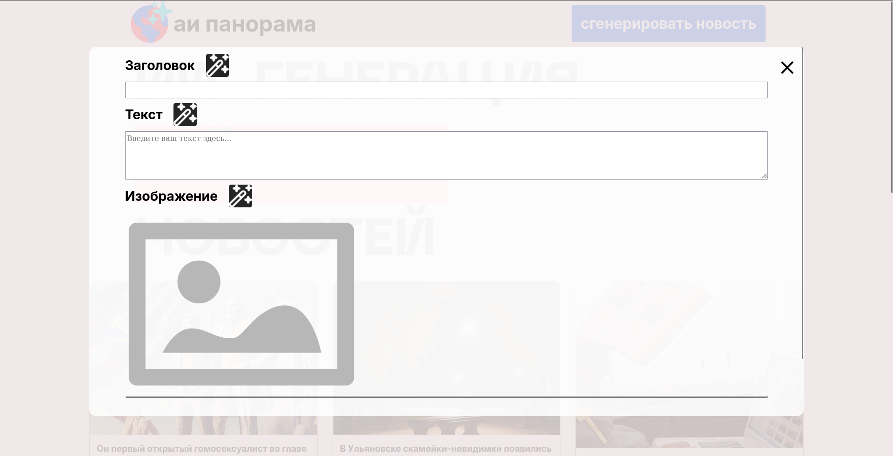
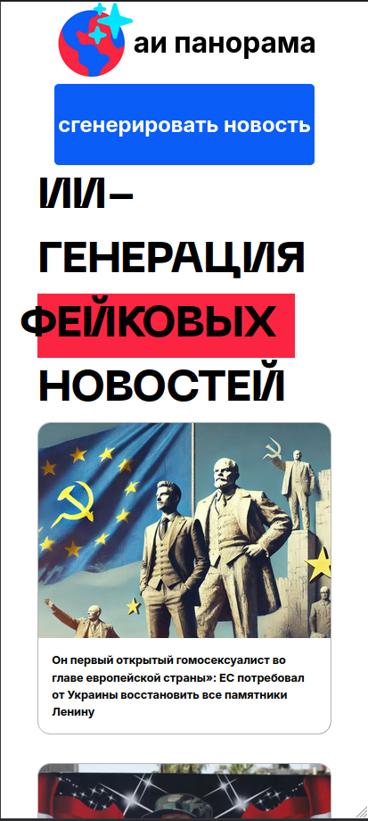
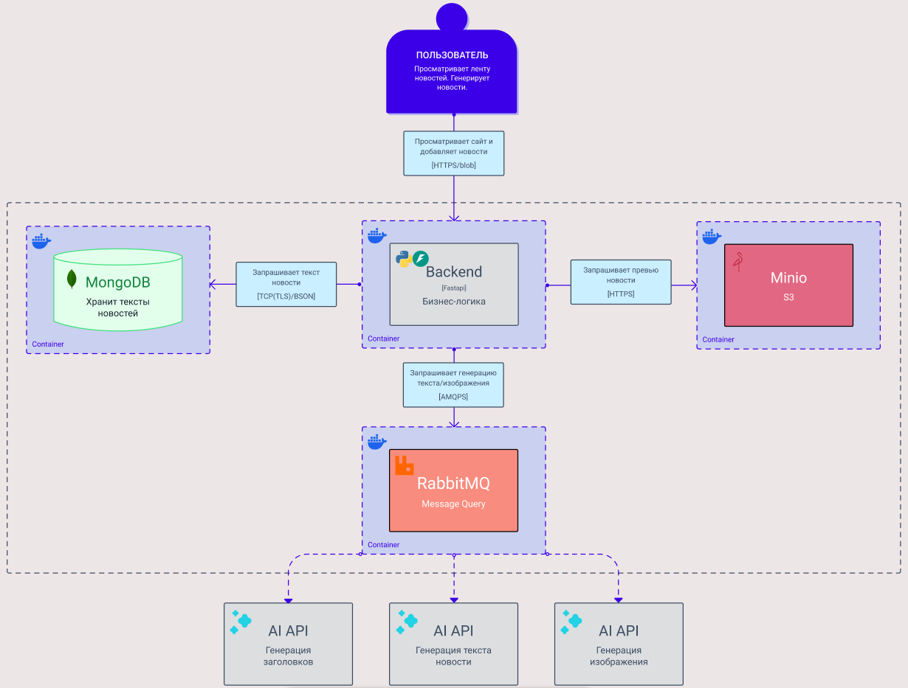

## АИ Панорама
AI генерация новостей

|                              |                  |
| ---------------------------- | ---------------- |
| Brokiloene                   | Frontend/Backend |
| valerasaray                  | Design/AI        |
| MarchAleksey                 | AI               |

## Архитектура (схема C4)

### Обоснование архитектуры
Одна точка входа для пользователя
Легко подключить дополнительные нейронки (всего в проекте их 3 типа), достаточно указать IP и порт RabbitMQ
Маршрутизация по Routing Keys RabbitMQ – backend взаимодействует с одной очередью и извлекает из нее нужные для него в данный момент данные

## Конфигурация проекта
Переименовать файл `sample.env` в `.env`
Добавить свои сертификаты в папку `/certs`
Запустить проект через `docker compose up`
