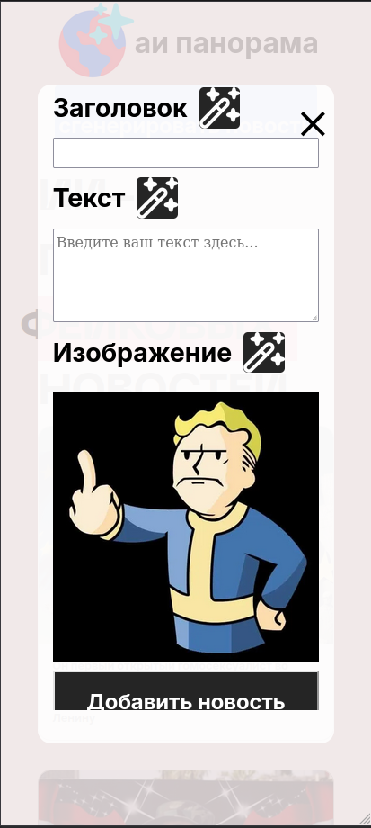
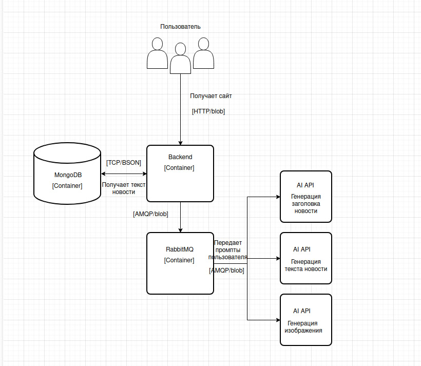

# Проект по дисциплине "Нейроинформатика"
## АИ Панорама

## Авторы
| ФИО                          | Группа      |
| ---------------------------- | ----------- |
| Рылов Александр Дмитриевич   | М80-407Б-21 |
| Соколов Арсений Игоревич     | М80-407Б-21 |
| Марченко Алексей Эдуардович  | М80-407Б-21 |

## Презентация проекта
https://docs.google.com/presentation/d/1S7XJIa-9Luv0pL-otTO94DXD1gf_V4lZ_kbYFZxiMI0/edit#slide=id.g3257e494b97_2_20
## Отчет
### Описание
### Бизнес цель проекта
- Описание проблемы: Отсутствие ресурса для автоматической генерации новостей, включающих текст, заголовки и изображения, приводит к длительным временным затратам и ручной работе.
- Цель: Создать автоматизированный сайт для генерации новостей с минимальным вовлечением человека.
- Целевая аудитория: Медиа-агентства, контент-креаторы, платформы для автоматической публикации новостей.
### ML-цель проекта
- Автоматизировать процесс создания качественных новостей (заголовок, текст, изображение).
- Использовать современные диффузионные модели и языковые модели для генерации контента.
- Обеспечить высокую производительность и масштабируемость для обработки запросов пользователей.
### Архитектура (схема C4)

### Обоснование архитектуры
Одна точка входа для пользователя
Легко подключать дополнительные нейронки (всего в проекте их 3), достаточно им указать IP и порт RabbitMQ
Удобная маршрутизация по Routing Keys RabbitMQ – backend взаимодействует с одной очередью и извлекает из нее нужные для него в данный момент данные

### Объяснение выбора используемого стека
#### **FastAPI**
- Асинхронность
- Высокая производительность
- Автоматическая генерация документации
#### MongoDB
- Для проекта нужна всего одна таблица
- Меньшее потребление ресурсов по сравнению с реляционными БД
- Поддержка сложных запросов
- Поддержка асинхронной обработки
#### RabbitMQ
- Гарантированная доставка
- Маршрутизация по ключам
- Поддержка асинхронной обработки

### Описание сетей
Backend использует порт 80 для связи с пользователями
Порт 5672 для связи с RabbitMQ
Порт 27017 для связи с MongoDB
Также открыт порт 15672 для доступа к панели управления RabbitMQ

## Конфигурация проекта
Переименовать файл env-sample в .env
## Запуск проекта
docker compose up
