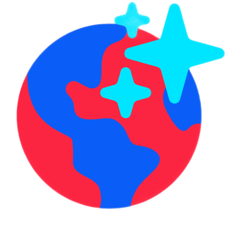
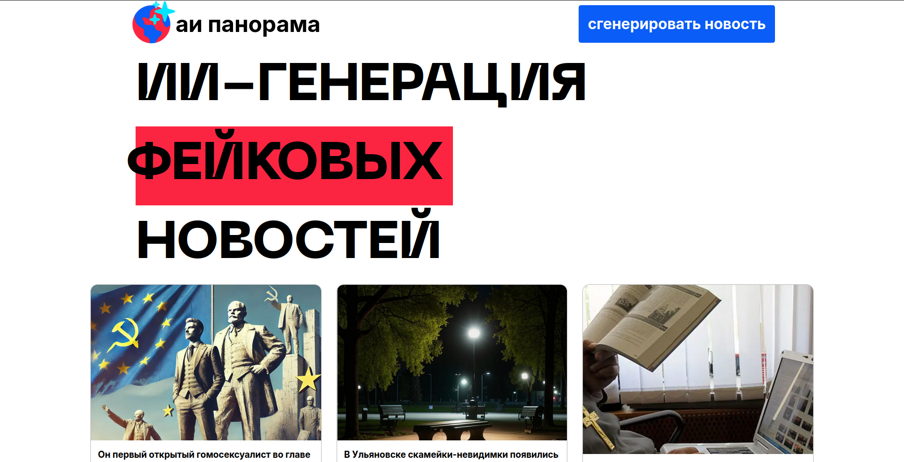

##  АИ Панорама 

### Вид на мобильных устройствах

## Создатели
|                              |                  |
| ---------------------------- | ---------------- |
| Brokiloene                   | Frontend/Backend |
| valerasaray                  | Design/AI        |
| MarchAleksey                 | AI               |

## Стек
|||
|-|-|
|**Backend**| Unicorn, Fastapi, Minio, RabbitMQ, MongoDB, Jinja|
|**Frontend**| HTML, CSS, JS|

## Архитектура (схема C4)

> Одна точка входа для пользователя  
> Легко подключить дополнительные нейронки (всего в проекте их 3 типа) -- достаточно указать IP и порт RabbitMQ  
> Маршрутизация по Routing Keys RabbitMQ – backend взаимодействует с одной очередью, извлекая из неё нужные данные  

## Запуск проекта
Переименовать файл `sample.env` в `.env`  
Добавить свои сертификаты в папку `/certs`  
Запустить проект через `docker compose up`  
